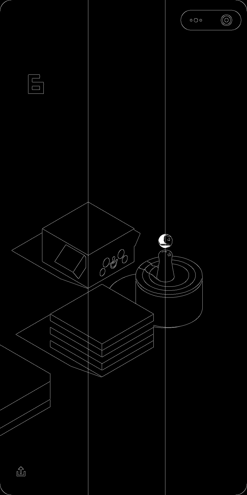
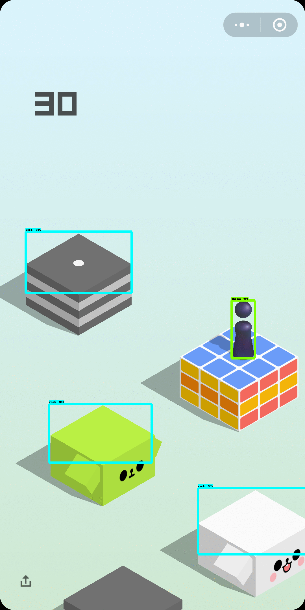
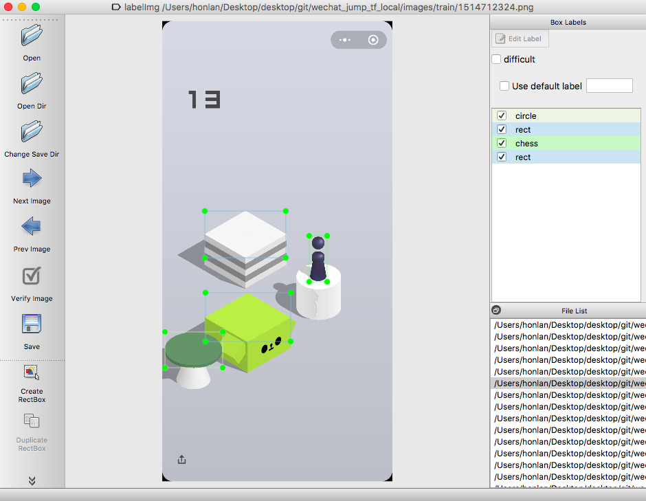

# 深度学习 - 微信跳一跳

### 项目介绍

参考知乎文章：[https://zhuanlan.zhihu.com/p/32553763](https://zhuanlan.zhihu.com/p/32553763)

### 所需环境

- `Python3.6`、`OpenCV2`、`TensorFlow`等
- `adb`，用于调试安卓手机，参考[https://github.com/wangshub/wechat_jump_game](https://github.com/wangshub/wechat_jump_game)

### 文件介绍

`simple`目录中的`simple.py`使用`OpenCV2`检测棋子和目标块的位置，简单粗暴

 
`tensorflow`目录包括以下文件：

- `retrain`：其中包含了物体检测模型的配置文件，以及物体类别映射文件；
- `utils`：提供辅助功能的文件；
- `wechat_jump_inference_graph`：训练好的物体检测模型；
- `wechat_auto_jump.py`：自动跳一跳的代码

`label.zip`提供了标注的工具，使用[labelImg](https://github.com/tzutalin/labelImg)进行物体检测标注，使用方法可以参考`物体检测标注说明.pdf`

